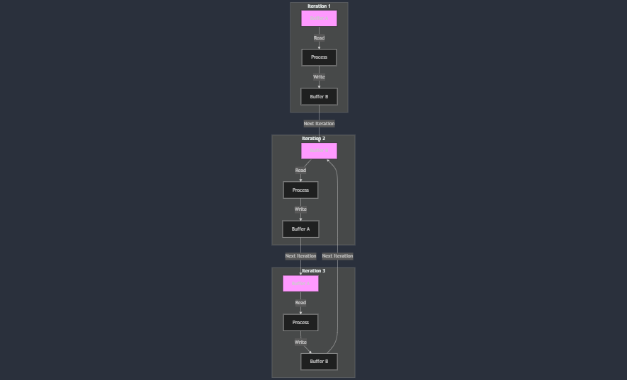

this was the hardest problem so far

i have multiple issue 

first i stored the seed into array

then i process maps into structs

but issue is that for each map there are number of entries e.g
seed-to-soil map:
50 98 2
52 50 48

has two entries 

so what i did was make a 2d array of struct 

row represent it each map and column represent entries of map

typedef struct
{
    uint64_t dest;
    uint64_t source;
    uint64_t range;

} map;

typedef struct
{
    map *maps;
    int number_of_entries;
} map_list;

map_list all_maps[MAX_MAPS];

there can max 7 maps and for each map there can be mulitple entries so coulmns are not defined in the 2d array

row represents the maps soil fertilizer water etc and they are total 7 in numbers

while column of struct array represent map data 

so basically am creating a list like this
   col1      col 2
{[50 98 2],[52 50 48]} map row 1

number of entries tells me how many columns i need to process 

## PART TWO

k so i think i can solve this problem like this

I have made a struct in C which contains 

seed_start
seed_range

i can use them to calculate a range 

seed_start=seed_start;
seed_end = seed_start+seed_range-1;

then i can use map to find out whether seed start and end intersect with map 

for that i need to have maximum of seed_start and map_start
stored in overlap_start
and minimum of seed_end and map_start+map_range
stored in overlap end

if overlap start is less than overlap end then it means that range is over lapping
and i can transform that range according to mapping algo

and if the range is not overlapping i.e overlap_start is greater than seed start and overlap_end is less than seed_end than that range is stored as it is in final_map and once done i can simple pick first index of final_map after sorting it out using qsort for minimum

I was not able to solve it myself claude ai solved it before i Can 

I understand your confusion. Let's break down the code and explain these concepts step by step:

Switching of current array:

The code uses two arrays to process the ranges efficiently. Let's explain why and how:
Seed_Ranges ranges[2][MAX_SEEDS * MAX_MAPS];
int current = 0; // Index to track which array is current

We have two arrays (ranges[0] and ranges[1]) to avoid copying data back and forth.
current keeps track of which array we're currently reading from.

for (int map_index = 0; map_index < MAX_MAPS; map_index++)
{
    int next = 1 - current; // Index of the array to fill
    // ... processing ...
    current = next;
}

For each map, we read from ranges[current] and write to ranges[next].
After processing all ranges for a map, we switch current to next.
This swapping technique allows us to efficiently move between input and output without copying entire arrays.

The mapped variable:

bool mapped = false;
// ... in the mapping loop ...
if (overlap_start <= overlap_end)
{
    // ... process overlap ...
    mapped = true;
    break;
}

mapped keeps track of whether a range has been transformed by any mapping in the current map.
If a range overlaps with a mapping, we set mapped = true and break the inner loop.
After the inner loop:

if (!mapped)
{
    ranges[next][new_count++] = r;
}

If mapped is still false, it means the range wasn't transformed by any mapping in this map.
In this case, we copy the range unchanged to the next array.

This approach ensures that:

Ranges that overlap with mappings are transformed.
Ranges that don't overlap with any mapping are passed through unchanged.
Ranges are split when they partially overlap with a mapping.

The switching of arrays and the mapped flag work together to efficiently process all ranges through all maps, handling transformations and splits as needed.
Does this explanation help clarify these aspects of the code? Let me know if you'd like me to elaborate on any part further.

## DOUBLE BUFFERING TECHNIQUE:

Certainly. Let's dive deeper into the double buffering technique and when to switch between buffers.
Double Buffering Explained:
Double buffering is a technique where two buffers (in our case, arrays) are used to hold data during processing. It's commonly used in graphics programming, audio processing, and other scenarios where you need to update a large set of data while still having access to the original data.
In our context:

Buffer A: Holds the current set of ranges
Buffer B: Will hold the processed ranges

The key idea is that we read from one buffer and write to the other, then swap their roles.
Double Buffering ProcessClick to open diagram
Detailed Process:

Initial State:

Buffer A contains the initial ranges
Buffer B is empty

Processing Map 1:

Read ranges from Buffer A
Process each range according to Map 1's rules
Write resulting ranges to Buffer B
After processing all ranges, switch: now consider B as the "current" buffer

Processing Map 2:

Read ranges from Buffer B (previous output)
Process each range according to Map 2's rules
Write resulting ranges to Buffer A
After processing, switch: now A is the "current" buffer again

Continue this pattern for all subsequent maps

When to Switch Buffers:
The key point is when to switch buffers. You switch after completely processing all ranges for a given map. Here's the logic:

Start processing a map
Read all ranges from the current buffer
Write all processed ranges to the other buffer
After all ranges are processed for this map, switch buffers

In code, this looks like:
cCopyint current = 0;
for (int map_index = 0; map_index < MAX_MAPS; map_index++) {
    int next = 1 - current;
    
    // Process all ranges for this map
    for (int i = 0; i < current_count; i++) {
        // Read from ranges[current]
        // Write results to ranges[next]
    }
    
    // Switch buffers after processing all ranges for this map
    current = next;
}
Benefits of Double Buffering:

Efficiency: Avoids copying all data back to a single array after each map processing step.
Clarity: Keeps the original data intact while working on the new set.
Parallelism potential: In more advanced implementations, you could potentially read and write in parallel.

Drawbacks:

Memory usage: Requires twice the memory compared to a single buffer.
Complexity: Can be more difficult to understand at first glance.

In our specific problem, double buffering is particularly useful because each map can potentially transform all ranges. By using two buffers, we ensure that we're always reading from the result of the previous map's processing, without needing to do a full copy operation between each map.
Does this more detailed explanation help clarify the double buffering technique and when to switch buffers? Let me know if you have any more questions or if you'd like to see how this compares to other approaches!

